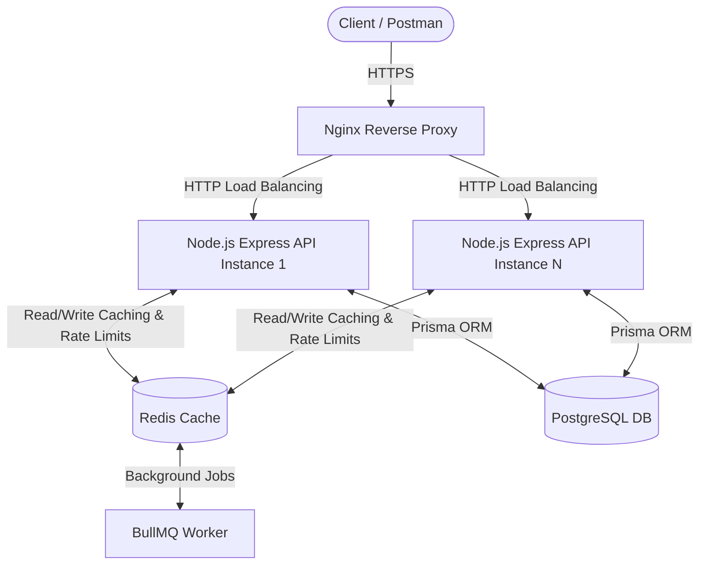

# Production-Ready Node.js CRUD API

An enterprise-grade, highly scalable Node.js REST API designed to handle from hundreds to millions of users. Built with Express.js, PostgreSQL, Prisma ORM, Redis, Nginx, and Docker.

---

## 📖 Project Overview

This project serves as a robust backend foundation for modern SaaS applications. It implements clean architecture principles, separating business logic from HTTP transport layers. 

Key architectural pillars:
- **Performance:** Redis caching, gzip compression, rate-limiting, async operations.
- **Security:** HttpOnly JWT cookies, Helmet headers, CORS, Zod validation, centralized error handling.
- **Scalability:** Stateless design, BullMQ for background jobs, Nginx reverse proxy load-balancing.
- **Developer Experience:** Strict TypeScript, ESLint, Prettier, Jest E2E tests, Prisma ORM.

---

## 🏗️ Architecture Diagram



---

## 📂 Folder Structure

```text
src/
├── config/           # Environment validation (Zod) and DB/Redis instantiations
├── controllers/      # Very thin HTTP transport layer, routes requests to Services
├── services/         # Core business logic (Auth, Users)
├── repositories/     # Database access layer using Prisma (Repository Pattern)
├── middleware/       # Express middlewares (Auth, Rate Limiting, Error Handling, Validation)
├── routes/           # API versioned routing (v1)
├── validations/      # Zod schemas for request validation
├── utils/            # Winston logger, Custom Error classes
├── cache/            # Redis cache service wrappers and caching middleware
├── jobs/             # BullMQ worker initialization and processors
├── queues/           # BullMQ queue definitions
├── prisma/           # Prisma schema and migrations
├── tests/            # Jest E2E and integration tests
├── app.ts            # Express application setup
└── server.ts         # Server bootstrap, Graceful shutdown logic
```

---

## ⚙️ Environment Variables

Create a `.env` file in the root of the project by copying the example:
```bash
cp .env.example .env
```

| Variable | Description | Default |
|----------|-------------|---------|
| `NODE_ENV` | Environment mode (`development`, `production`) | `development` |
| `PORT` | Node.js server port | `3000` |
| `DATABASE_URL` | PostgreSQL connection string | `postgresql://...` |
| `REDIS_HOST` | Redis instance host | `localhost` |
| `REDIS_PORT` | Redis instance port | `6379` |
| `JWT_SECRET` | Secret key for signing Access Tokens | `super_secret` |
| `JWT_EXPIRES_IN` | Access token lifespan | `1h` |
| `REFRESH_TOKEN_EXPIRES_IN`| Refresh token lifespan | `7d` |
| `COOKIE_SECRET` | Secret for signed cookies | `secret` |
| `CORS_ORIGIN` | Allowed client origins | `http://localhost:3001` |

---

## 🚀 Setup Instructions

### Option 1: Running Locally (Development)

1. **Start Infrastructure (Postgres & Redis):**
   ```bash
   docker-compose up -d postgres redis
   ```
2. **Install Dependencies:**
   ```bash
   npm install
   ```
3. **Database Setup:**
   ```bash
   npm run db:generate
   npm run db:migrate
   ```
4. **Start the API:**
   ```bash
   npm run dev
   ```
5. **Start the Background Worker (Optional):**
   ```bash
   npm run worker
   ```

### Option 2: Running with Docker (Production Stack)

To run the entire stack (API, Postgres, Redis, Nginx) inside Docker:
```bash
docker-compose up -d --build
```
*Note: The API will be accessible via Nginx on port `80`.*

---

## 🗄️ Database Migrations & Seeding

**Prisma** is used to manage the PostgreSQL schema.
- **Migrate:** `npm run db:migrate` creates and applies migrations based on `prisma/schema.prisma`.
- **Generate Client:** `npm run db:generate` generates the TypeScript types.
- **Seeding:** To seed the database, add a `seed.ts` file in `prisma/` and add `"prisma": { "seed": "ts-node prisma/seed.ts" }` to your `package.json`. Then run `npx prisma db seed`.

---

## 🔐 Authentication Flow

This API utilizes **HttpOnly Cookies** to provide superior security against Cross-Site Scripting (XSS) attacks.

1. **Login (`POST /api/v1/auth/login`)**: Client sends email/password. Server verifies and sets two HttpOnly cookies:
   - `accessToken`: Short-lived (1 hour) JWT.
   - `refreshToken`: Long-lived (7 days) UUID stored in Redis.
2. **Protected Routes (`GET /api/v1/users`)**: The browser/Postman automatically attaches the `accessToken` cookie. The `authMiddleware` verifies the JWT.
3. **Refresh (`POST /api/v1/auth/refresh`)**: When the access token expires, hitting the refresh endpoint checks the `refreshToken` cookie against Redis and issues new cookies.
4. **Logout (`POST /api/v1/auth/logout`)**: Clears cookies and deletes the refresh token from Redis.

---

## 🔌 API Endpoints

*Prefix: `/api/v1`*

### Authentication
- `POST /auth/register` - Create a new user
- `POST /auth/login` - Authenticate and receive cookies
- `POST /auth/refresh` - Issue new tokens via refresh cookie
- `POST /auth/logout` - Invalidate session

### Users (Requires Authentication)
- `GET /users` - Get paginated list of users *(Redis Cached)*
- `GET /users/:id` - Get specific user *(Redis Cached)*
- `PUT /users/:id` - Update user details *(Invalidates Cache)*
- `DELETE /users/:id` - Delete user *(Invalidates Cache)*

---

## 🧠 Redis Usage Deep Dive

Redis is a first-class citizen in this architecture, used for multiple critical paths:

1. **API Response Caching (`src/cache/cache.middleware.ts`)**: 
   - `GET` endpoints are automatically cached.
   - Cache invalidation occurs on write operations (Create, Update, Delete) using pattern matching to ensure fresh data.
2. **Session & Token Management**:
   - Refresh tokens are stored in Redis with a TTL of 7 days (`CacheService.set`). This allows immediate, global session revocation.
3. **Rate Limiting (`src/middleware/rateLimiter.ts`)**:
   - Backed by `rate-limit-redis`. Limits IP addresses to prevent abuse (e.g., max 5 login attempts per hour).
4. **Background Job Queue (`BullMQ`)**:
   - CPU-intensive or slow operations (like sending emails) are offloaded to Redis queues and processed by detached workers.

---

## 🛡️ Nginx Configuration

The `nginx.conf` file acts as the front-facing web server:
- **Reverse Proxy:** Routes traffic from port 80 to the internal Node.js container(s).
- **Load Balancing:** Ready to round-robin requests if you scale the API to multiple containers via `upstream`.
- **Gzip Compression:** enabled for JSON, CSS, JS to reduce payload sizes.
- **Security Headers:** Hides Nginx version, adds X-Frame-Options, X-XSS-Protection, and enforces client body limits (10MB) to prevent buffer overflow/DDoS attacks.

---

## 🧪 Testing

The API uses **Jest** and **Supertest** for End-to-End integration testing. Tests interact with the actual Postgres DB and Redis instance.

```bash
npm run test
```
- A global teardown runs after each test to truncate tables and flush Redis, ensuring zero test contamination.

---

## 📈 Scaling Recommendations

To scale this application from 100 to millions of users:

1. **Horizontal Scaling (Statelessness):** Spin up multiple instances of the Express container. Nginx will automatically load balance. Because sessions are stored in Redis (not memory), scaling out requires zero code changes.
2. **Database:** 
   - Implement read replicas in PostgreSQL.
   - Route `GET` requests to the read replica in `db.ts` while keeping `POST/PUT/DELETE` on the primary instance.
3. **Redis Cluster:** Migrate from a single Redis instance to a Redis Cluster for highly available caching.
4. **CDN:** Put Cloudflare or AWS CloudFront in front of Nginx to cache static assets and mitigate DDoS attacks globally.

---

## 🚀 Deployment Guide

1. **Provision a VM (AWS EC2, DigitalOcean Droplet, etc.)**
2. **Install Docker and Docker Compose.**
3. **Clone the repository.**
4. **Configure SSL:**
   - Uncomment the SSL sections in `nginx/nginx.conf`.
   - Use `certbot` to provision Let's Encrypt certificates and mount them into the Nginx container.
5. **Set Production Envs:** Change `.env` so `NODE_ENV=production` and use highly secure passwords.
6. **Launch:** `docker-compose up -d --build`.

---

## 🚑 Troubleshooting

- **Redis Connection Error:** Ensure Docker is running. Check if port 6379 is occupied.
- **Prisma "Table not found":** Run `npm run db:migrate` to construct the database schema.
- **Tests Failing:** Ensure `.env` is loaded properly in tests. Do not run tests in production as it flushes the database. 
- **Cookies not attaching in Postman:** Ensure the requested URL exactly matches the domain (e.g., `localhost`). Postman will manage HttpOnly cookies automatically in the "Cookies" tab.
